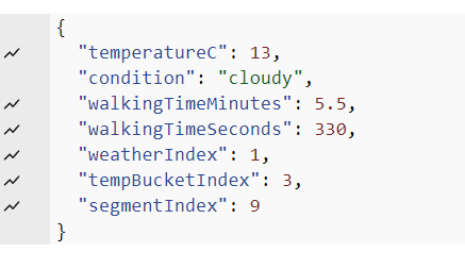

# SkySync_Transit

## Work Division Agenda

**Course:** CASA0019: Sensor Data Visualisation (25/26)

**Total length:** \~2000 words (±10%)

---

## 1. Front Page & Administrative Info（≈150 words）

- Project Title: _SkySync_Transit_

- Course name & academic year

- Group members（姓名 + GitHub username）

- GitHub repository link（可访问）

- 简短 project tagline（1–2 句）

---

## 2. Project Rationale & Context（≈300 words）

- 为什么选择“UCL 学生通勤”作为主题

- _bus + weather + timetable_？

- 体现 **Sensor Data Visualisation**

- 与 CASA0019 课程内容（physical computing / data devices / visualisation

---

- 真实场景（One Pool Street → Stratford）

- 时间敏感性（下课 → 赶车）

- 信息压力 vs 直观可视化的价值

---

## 3. System Overview & Design Concept（≈250 words）

- Physical device + Digital twin 的设计逻辑

- API / MQTT / Sensors

- Digital Twin（debug / scalability / demo）

- System flow diagram

---

## 4. Physical Device Design & Implementation（≈400 words）

### 4.1 Hardware Design

- ESP8266&#x20;

- Rotary sensor ( input

- Servo + LED + LCD ( output

- 3D 打印结构（route / gauge）

### 4.2 Data Visualisation Logic（Physical）

- 指针 \= walking time & weather

- LED \= urgency / time pressure

- LCD \= numerical & textual 补充

---

## 5. Digital Twin & Dashboard Design（≈300 words）

- Digital twin 与 physical device 同步

- Gauge zones & segments&#x20;

- “更详细信息”

- 图像识别 ( bus line switching ）

---

## 6. Software, Data & Technologies（≈300 words）

The data transmission portion of this project primarily relies on the MQTT protocol to transmit signals to the assembled electronic devices and on the API to transmit data to the digital twin system. The project mainly established three MQTT topics for devices to subscribe to: the timetables for bus routes 339 and 108, and the current London temperature and estimated walking time to the station. The API also provides the same three types of data. Using these three datasets, the digital twin and devices can effectively acquire data and display it clearly and efficiently.

More precisely, the data in the project mainly comes from publicly available data on authoritative websites. The timetable information for bus routes 339 and 108 is entirely sourced from the TFL website. Additionally, the London weather and temperature information is obtained from the Open-Meteo website, ensuring overall accuracy and reliability (Paudyal, Shakya and Upadhayaya, 2025). The data printed in this project is formatted as shown in the image below.

  
  

For timetables, the first line prints the bus number for easy identification during calls. The second and third lines print the arrival times at London Aquatics and Stratford City stations, respectively. The fourth line indicates whether the bus is recommended. This line helps users choose recommended buses. The project combines the daily class dismissal times and student arrival times at the station to calculate which bus will arrive first after students reach the station and recommends that bus.

For weather-related MQTT topics and APIs, the first line prints the current temperature in London. The second line prints the current weather in London. The third and fourth lines print the walking time from the school to the station in minutes and seconds, respectively. This time is mainly determined by a specific formula based on the current weather and temperature (Dunn, Shaw and Trousdale, 2012). Lines five, six, and seven mainly guide the pointer movement to accurately indicate the estimated time.
### 6.3 Tools & Platforms

- Arduino / ESP8266

- Unity / dashboard tools

- GitHub as documentation & reproducibility platform

---

## 7. Contributions（≈200 words）

-        *   Hardware & electronics

         *   Software & API integration

         *   Digital twin & UI

         *   Fabrication & physical design

         *   Documentation & GitHub management

  ***

## 8. What Worked & What Didn’t & Future Improvements

Overall, the project largely achieved its initial goals. The team enabled students to visually see the bus schedules they should take after class, use a pointer to determine the current weather and estimated travel time, and select specific bus routes using a knob. 
However, some goals were not achieved. Initially, the team planned to display all bus information on the hardware in a scrolling display, but they discovered that the processor's storage was insufficient to load the entire schedule, forcing them to abandon this feature (Hercog et al., 2023). Furthermore, the box's structure hindered the display of current weather and walking time. Firstly, the box itself was not large enough while the pointer was slightly long, causing it to touch the left wall of the box when pointing to the far left. Secondly, the pointer was designed inside the box, requiring a slot to be clearly visible, which was inconvenient, making it difficult for users to clearly observe the pointer's direction most of the time. 
To address these shortcomings, future updates to the project will focus on two aspects: firstly, using a more powerful processor with more storage to ensure the display of the entire timetable and more other data. In addition, the team will also consider redesigning the entire box structure to ensure that the box structure itself does not conflict with the pointer's path, or designing the pointer as an external structure to ensure that users can clearly observe the pointer's position.
## 10. Repository Structure & Reproducibility（≈150 words）

- GitHub repo 结构说明

- Code / Unity / STL / diagrams

- How to reproduce the project

- Reference & citation strategy

---

## 11. Conclusion（≈100 words）

- 项目价值总结

- 与 CASA0019 learning outcomes 对应

- Physical data visualisation 的意义

